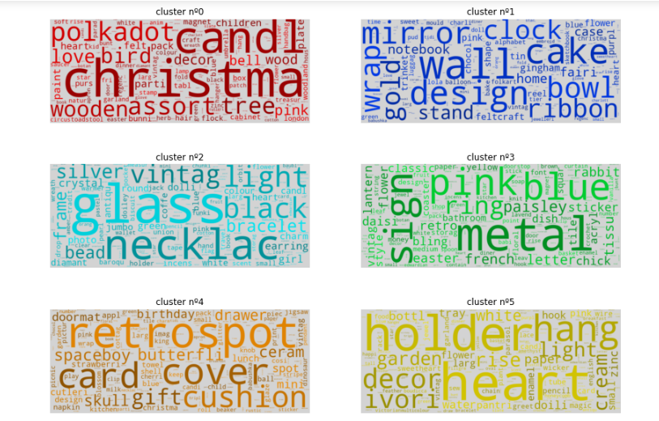
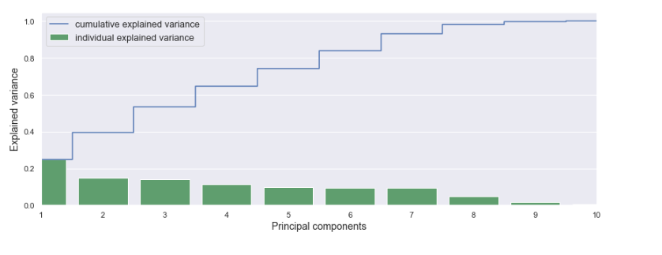
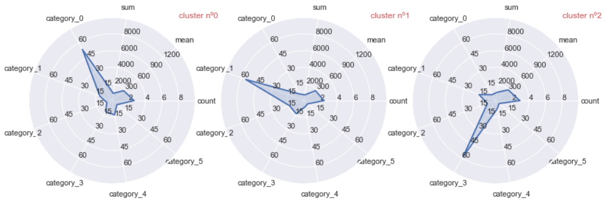

# Segmentation-for-E-commerce

Segmentaion for customers, to predict what they would but on their next visit according to their history

# First
### product Clustering

we cluster the products using tf-idf technique to get each term a score based on its importance in such product
and created matrix to be applied on `K-Means Clustering algorithms`

# Second
### Customer Clustering

We add such **product categories** through the main dataframe, such that each **Customer** got a defined **Category**
Some New Features were added to such Dataframe, such as:
  * Number of visits
  * total Cashe payed
  * Min/ Max Cashe payed 
  * Average Cashe payed

After that we Begin the Clustering with `K-Means Clustering algorithms` which ended to be `11 customer categories`

# Third
### final Dataframe
The final Dataframe will contains all information of each **Customer Cluster**
Dimensions (11,13) ::
  - 11 Clusters
  - 13 Feature (`cluster`,[`count`, `sum`, `Avg`, `min`,`max`], [`6 product category`])

Such Dataframe will be the Key for the followin Gerat Radar Visulization

# Finally
### We Do the Customer Classification

models Used [`Support Vector Machine`, `Logostic Regression`,  `k-Nearest Neighbors`, `Decision Tree`, `Random Forest`, `Gradient Boosting`]
Which Ends with ***87.38*** Prediction accuracy

